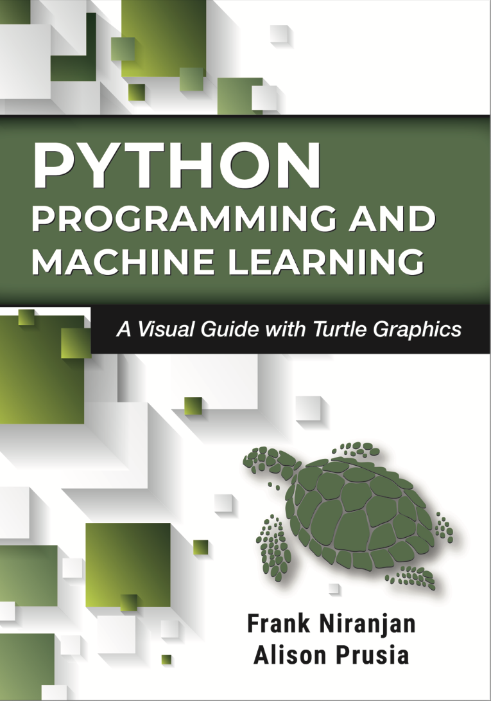

# Python Turtle & ML — Student Code

Welcome!

This repository is organized by chapters. Each chapter has its own folder and a short `README.md`.
Start by dropping your code files into the correct `chapter-XX/` folder.

## Structure
- `chapter-01/` — Intro to Turtle (no loops/functions) — *add files here*
- `chapter-02/` — *coming soon*
- `chapter-03/` — *coming soon*
- ...
- `chapter-19/` — *coming soon*

## Tips
- Keep filenames short and descriptive (e.g., `02_square_basic.py`).
- End Turtle scripts with `turtle.done()` so the window stays open.
- One small concept per file is best for students.

## How to add your code
1. Open the chapter folder (e.g., `chapter-01/`).
2. Upload `.py` files or create them directly on GitHub.
3. Update the chapter’s `README.md` with a simple list of files and what they do.
